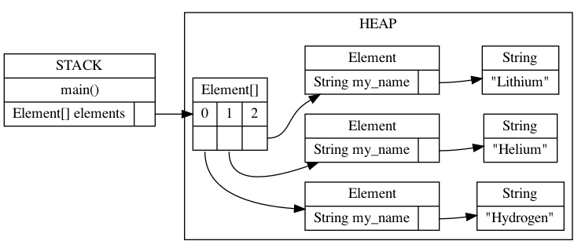
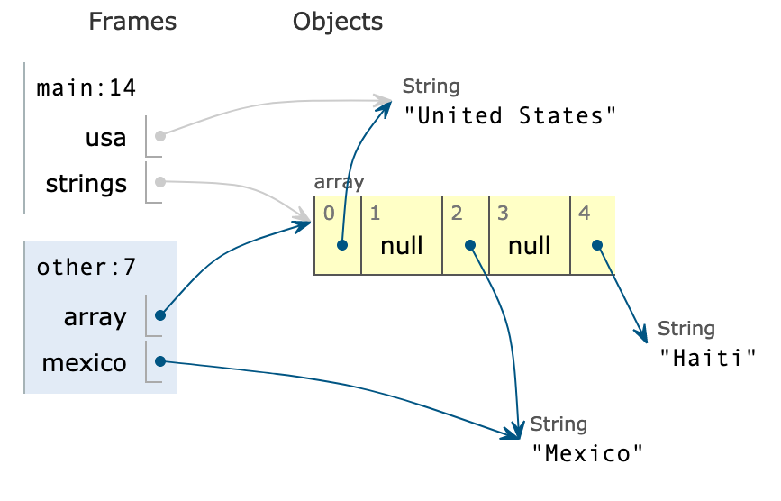
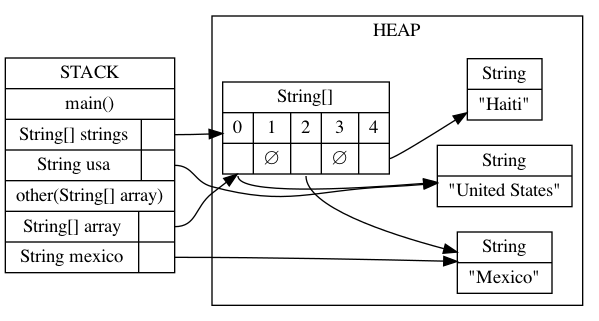

# 08/26: Memory and Pointers

## Review

1. In your own words, explain what the stack is, and what kind of data goes in the stack.
2. In your own words, explain what the heap is, and what kind of data goes in the heap.
3. *Primitive datatypes* are `bool`, `char`, `short`, `int`, `long`, `float`, `double`. Do variables of primitive datatypes live in the stack or the heap?
4. *Object datatypes* are classes, such as `Car` and `Engine`. Do variables of object datatypes live in the stack or the heap?
5. Would a `String` live in the stack or the heap? Why?
6. In your own words, explain the difference between local variables and reference variables.
7. Draw the stack and heap at the indicated place in the code. You can use [Java Tutor](http://pythontutor.com/java.html) to check your answer.

    ```java
    public class Worksheet {

        public int twice(int n) {
            int result = 2 * n;
            // DRAW MEMORY HERE
            return result;
        }

        public int thrice(int n) {
            int result = 3 * n;
            return result;
        }

        public int sixce(int n) {
            return twice(thrice(n))
        }

        public static void main(String [] args) {
            int n = 7;
            System.out.println(sixce(n));
        }

    }
    ```

## Exploration

1. `null` is a special value in Java for reference variables that do not currently refer to anything. In the code from the video (below), on which line(s) would a variable be set to `null`?

    ```java
    public class MemoryModel {

        static class Engine {
            String name = "Turbo";
        }

        static class Car {

            int id;
            int hp;
            Engine myEngine;

            public Car(int id) {
                this.id = id;
            }
        }

        public static void doMore() {
            System.out.println("doing more stuff...");
        }

        public static void doWork() {
            double weight = 120.30;
            doMore();
        }

        public static void main(String[] args) {
            int age;
            age = 12;
            age = 15;
            String name = "";

            Car myCar;
            myCar = new Car(1);
            myCar = new Car(2);

            Car my2Car = new Car(3);
            my2Car.hp = 120;

            Car my3Car = new Car(4);
            my3Car.hp = 1000;

            Engine bigEngine = new Engine();
            my3Car.myEngine = bigEngine;
        }

    }
    ```

2. Arrays are also reference variables. In the code below, we create an array of three elements, then set the 0th element to 37 and the 1st element to 42. Using [Java Tutor](http://pythontutor.com/java.html) to check your answer, draw out memory at the indicated place in the code. Make sure you select "render all objects on the heap" and "draw pointers as arrows".

    ```java
    public class Worksheet {
        public static void main(String[] args) {
            int[] array = new int[3];
            array[0] = 37;
            array[1] = 42;
            // DRAW MEMORY HERE
        }
    }
    ```

3. Draw out memory at the indicated place in the code. Explain why that is the result.

    ```java
    public class Worksheet {
        public static void main(String[] args) {
            int[] array1 = new int[3];
            array1[1] = 42;
            int[] array2 = array1;
            array2[0] = 37;
            // DRAW MEMORY HERE
        }
    }
    ```

4. Draw out memory at the indicated place in the code. Explain why that is the result.

    ```java
    public class Worksheet {

        public static void helper(int[] data) {
            int x = 37;
            data[0] = x;
            // DRAW MEMORY HERE
        }

        public static void main(String[] args) {
            int[] array = new int[3];
            array[1] = 42;
            helper(array);
            System.out.println(array[0]);
        }

    }
    ```

5. Draw out memory at the indicated place in the code. Explain why that is the result.

    ```java
    public class Worksheet {
        public static void main(String[] args) {
            String[] array = new String[3];
            array[1] = "hello";
            // DRAW MEMORY HERE
        }
    }
    ```

6. Consider the following two (equivalent) diagrams of memory below. Change the code marked `FIXME` so that memory will be as depicted at the indicated place in the code.

    

    

    ```java
    public class Worksheet {

        static class Element {
            private String my_name;

            public Element(String name) {
                this.my_name = name;
            }

        }

        public static void main(String[] args) {
            Element[] elements = new Element[3];
            // FIXME

            // MEMORY DRAW HERE
        }

    }
    ```

7. Consider the following two (equivalent) diagrams of memory below. Change the code marked `FIXME` so that memory will be as depicted at the indicated place in the code.

    

    

    ```java
    public class Worksheet {

        public static void other(String[] array) {
            // FIXME

            // MEMORY DRAWN HERE
        }

        public static void main(String[] args) {
            // FIXME
        }

    }
    ```

## Challenge

1. Explain the difference between comparing objects with `==`, vs. comparing objects with `.equals()`. Read some of the search results from Google, then re-explain the difference in your own words.

2. Using [Java Tutor](http://pythontutor.com/java.html), revisit the code from Exploration Q1 or Q6. Go to where a constructor is called, and notice how the stack frame has a local variable called `this`, which does not appear in the code anywhere. What does `this` point to?
